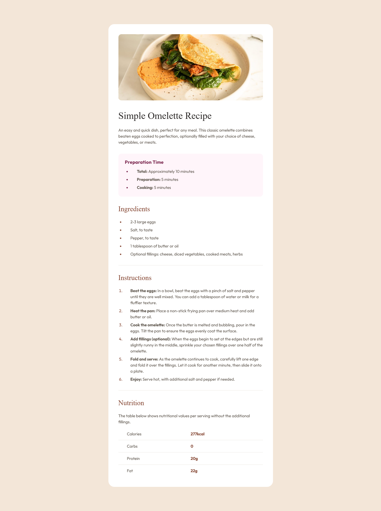

# Frontend Mentor - Recipe page solution

This is a solution to the [Recipe page challenge on Frontend Mentor](https://www.frontendmentor.io/challenges/recipe-page-KiTsR8QQKm). Frontend Mentor challenges help you improve your coding skills by building realistic projects. 

## Table of contents

- [Overview](#overview)
  - [The challenge](#the-challenge)
  - [Screenshot](#screenshot)
  - [Links](#links)
- [My process](#my-process)
  - [Built with](#built-with)
  - [What I learned](#what-i-learned)
  - [Continued development](#continued-development)
  - [Useful resources](#useful-resources)
- [Author](#author)
- [Acknowledgments](#acknowledgments)

## Overview

### Screenshot

### Links

- Solution URL: [Github](https://github.com/AutumnsCode/frontendmentor-projekte/tree/main/newbie/recipe-page)
- Live Site URL: [live version](https://wondrous-profiterole-f56d88.netlify.app/)

## My process

### Built with

- Semantic HTML5 markup
- Mobile-first workflow
- css-properties
- Scss

### What I learned

Well, what I did learn? The answer must be working better with the list-element as ul, ol. My default reaction to them is usually by disable them. However this time it was require to work with them. I don't think I nailed it completely, and will try to developing learning them in the future.

### Continued development
Styling list items

### Useful resources

- [Kevin Powell](https://www.youtube.com/@KevinPowell) - This helped me since the beginning. Amazing trick and tips and the starter-kit I have from him

## Author

- Website - [AutumnsCode](https://github.com/AutumnsCode)
- Frontend Mentor - [@autumnsCode](https://www.frontendmentor.io/profile/AutumnsCode)

## Acknowledgments

Kevin Powell - without your teaching, I wouldnt able to do any of it.
